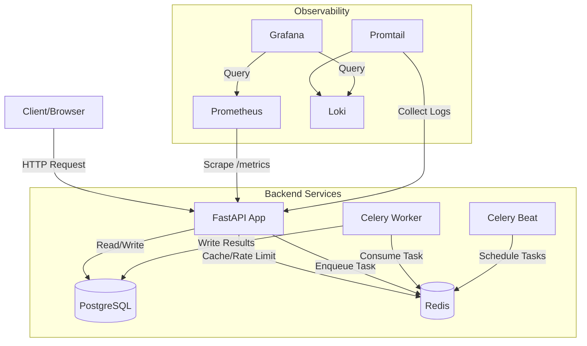
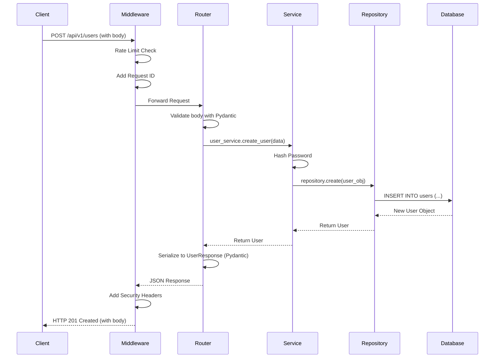

# FastAPI Production App - Complete Project Guide

> **A comprehensive, beginner-friendly explanation of a production-ready FastAPI application.**

This document is your one-stop guide to understanding this project from end to end. Whether you're a Python beginner, a developer preparing for interviews, or an architect evaluating the design, this guide has you covered.

---

## Table of Contents

1.  [What is This Project?](#1-what-is-this-project)
2.  [Technology Stack](#2-technology-stack)
3.  [Project Structure Explained](#3-project-structure-explained)
4.  [The Entry Point: `main.py`](#4-the-entry-point-mainpy)
5.  [Understanding Middlewares](#5-understanding-middlewares)
6.  [The Layered Architecture: Repository, Service, Router](#6-the-layered-architecture-repository-service-router)
7.  [Dependency Injection in FastAPI](#7-dependency-injection-in-fastapi)
8.  [Database Concepts: SQLAlchemy & Alembic](#8-database-concepts-sqlalchemy--alembic)
9.  [Pydantic: Data Validation Made Easy](#9-pydantic-data-validation-made-easy)
10. [Authentication (JWT)](#10-authentication-jwt)
11. [Background Tasks with Celery & Redis](#11-background-tasks-with-celery--redis)
12. [Caching with Redis](#12-caching-with-redis)
13. [Docker: Containerizing the Application](#13-docker-containerizing-the-application)
14. [Observability: Prometheus & Grafana](#14-observability-prometheus--grafana)
15. [Security Hardening](#15-security-hardening)
16. [Architectural Diagrams](#16-architectural-diagrams)
17. [Python Libraries Used](#17-python-libraries-used)
18. [Interview Questions & Answers](#18-interview-questions--answers)

---

## 1. What is This Project?

This is a **production-ready web API** built using **FastAPI**, a modern Python web framework. It's designed to be a template or "boilerplate" that you can use to build real-world applications.

**Key Features:**
-   User registration and login (Authentication).
-   Background task processing (sending emails, generating reports).
-   Caching for faster responses.
-   Full observability (metrics, logs, dashboards).
-   Containerized with Docker for easy deployment.

Think of it as a starting point for any backend project that needs to be reliable, fast, and scalable.

---

## 2. Technology Stack

| Category | Technology | Purpose |
|---|---|---|
| **Framework** | FastAPI | The web framework for building our API. |
| **Language** | Python 3.12 | The programming language. |
| **Database** | PostgreSQL | Stores persistent data like users. |
| **ORM** | SQLAlchemy | Talks to the database using Python code instead of raw SQL. |
| **Migrations** | Alembic | Manages changes to the database schema over time. |
| **Cache/Broker** | Redis | Stores temporary data (cache) and acts as a message broker for background tasks. |
| **Task Queue** | Celery | Runs background jobs (e.g., sending an email after user registration). |
| **Containerization** | Docker | Packages the app and its dependencies into a portable container. |
| **Orchestration** | Docker Compose | Runs multiple containers (app, db, redis) together locally. |
| **Monitoring** | Prometheus & Grafana | Collects and visualizes application metrics. |
| **Logging** | Loki & Promtail | Collects and stores application logs. |

---

## 3. Project Structure Explained

Understanding the folder structure is the first step to understanding any project. Here is what each part does:

```
FastAPI-app/
├── app/                     # <-- The main application code lives here
│   ├── api/                 # <-- API endpoint definitions (the "R" in REST)
│   │   ├── v1/              # <-- Version 1 of the API
│   │   │   ├── endpoints/   # <-- Individual endpoint files (users.py, login.py)
│   │   │   └── api.py       # <-- Combines all endpoints into one router
│   │   └── deps.py          # <-- Dependency functions (e.g., get current user)
│   ├── core/                # <-- Core logic: config, security, database connection
│   │   ├── config.py        # <-- Reads settings from environment variables
│   │   ├── db.py            # <-- Database connection setup
│   │   ├── security.py      # <-- Password hashing, JWT creation
│   │   ├── cache.py         # <-- Redis caching utilities
│   │   └── repository.py    # <-- Base class for database operations
│   ├── middleware/          # <-- Middleware components (rate limiting, logging)
│   ├── models/              # <-- Database table definitions (SQLAlchemy models)
│   ├── schemas/             # <-- Data validation schemas (Pydantic models)
│   ├── services/            # <-- Business logic layer
│   ├── repositories/        # <-- Data access layer (interacts with DB)
│   ├── tasks/               # <-- Background Celery tasks
│   └── main.py              # <-- THE ENTRY POINT OF THE APPLICATION
├── tests/                   # <-- All test files
├── k8s/                     # <-- Kubernetes manifests for deployment
├── docs/                    # <-- Project documentation
├── deploy/                  # <-- Configuration for Prometheus, Grafana, Loki
├── docker-compose.prod.yml  # <-- Docker setup for production
└── pyproject.toml           # <-- Project dependencies and tool settings
```

### Why This Structure?

This structure is called a **Layered Architecture** or **Clean Architecture**. Its purpose is **Separation of Concerns**. Each layer has one job:

| Layer | Folder | Responsibility |
|---|---|---|
| **Presentation** | `api/` | Handle HTTP requests and responses. |
| **Business Logic** | `services/` | Implement business rules (e.g., "a user cannot create duplicate accounts"). |
| **Data Access** | `repositories/` | Read from and write to the database. |
| **Domain** | `models/`, `schemas/` | Define the shape of data. |
| **Infrastructure** | `core/`, `middleware/` | Configuration, security, and cross-cutting concerns. |

This makes the code easier to test, maintain, and scale.

---

## 4. The Entry Point: `main.py`

The file `app/main.py` is where everything starts. When you run the application, this is the first file executed.

**What happens in `main.py`:**

1.  **Create the App Instance:**
    ```python
    app = FastAPI(title=settings.PROJECT_NAME, ...)
    ```
    This creates our FastAPI application object.

2.  **Lifespan Events (Startup/Shutdown):**
    ```python
    @asynccontextmanager
    async def lifespan(app: FastAPI):
        # STARTUP: Code that runs when the app starts
        app.state.redis = await aioredis.from_url(...)
        yield
        # SHUTDOWN: Code that runs when the app stops
        await app.state.redis.close()
    ```
    This is where we establish connections to Redis and PostgreSQL when the app starts, and close them gracefully when it stops.

3.  **Include Routers:**
    ```python
    app.include_router(api_router, prefix=settings.API_V1_STR)
    ```
    This connects our API endpoints (defined in `api/v1/`) to the main app.

4.  **Add Middlewares:**
    ```python
    app.add_middleware(SecurityHeadersMiddleware)
    app.add_middleware(RateLimitMiddleware, ...)
    ```
    Middlewares are added here (explained in the next section).

5.  **Health Check Endpoints:**
    ```python
    @app.get("/health/live")
    def health_live():
        return {"status": "ok"}
    ```
    These are simple endpoints used by orchestrators like Kubernetes to check if the app is running and ready.

---

## 5. Understanding Middlewares

**What is Middleware?**

Middleware is code that runs **for every request** before it reaches your endpoint, and **for every response** before it goes back to the client. Think of it as a security guard at the door of your application.

```
Client Request --> [Middleware 1] --> [Middleware 2] --> Your Endpoint
                                                               |
Client Response <-- [Middleware 1] <-- [Middleware 2] <-- Your Endpoint
```

**Middlewares in This Project (`app/middleware/`):**

| Middleware | File | Purpose |
|---|---|---|
| `RequestIDMiddleware` | `main.py` | Assigns a unique ID to every request for tracing. |
| `CORSMiddleware` | `main.py` | Allows the frontend (on a different domain) to talk to this API. |
| `SecurityHeadersMiddleware` | `security.py` | Adds security headers like `X-Frame-Options` to prevent attacks. |
| `RateLimitMiddleware` | `rate_limit.py` | Limits requests to 100/minute per IP to prevent abuse. |
| `LoggingMiddleware` | `logging.py` | Logs details of every request for debugging. |
| `TimingMiddleware` | `timing.py` | Measures how long each request takes. |

**Order Matters:** Middlewares are executed in **reverse order** of how they are added. The last one added is the first one to receive the request.

---

## 6. The Layered Architecture: Repository, Service, Router

This is the core design pattern of the project. Let's trace a request from start to finish.

**Example: Creating a New User**

1.  **Router (`api/v1/endpoints/users.py`):**
    The HTTP request hits the `create_user_open` endpoint.
    ```python
    @router.post("/", response_model=UserResponse)
    async def create_user_open(*, db: AsyncSession = Depends(get_db), user_in: UserCreate):
        # 1. The router receives the request.
        # 2. It calls the service layer.
        user = await user_service.create_user(db, obj_in=user_in)
        return user
    ```
    *The Router's job is to handle the HTTP layer. It doesn't know how to hash passwords or save to a database.*

2.  **Service (`services/user_service.py`):**
    The service handles the **business logic**.
    ```python
    async def create_user(self, db: AsyncSession, obj_in: UserCreate) -> User:
        # 3. The service hashes the password (business rule!).
        hashed_password = get_password_hash(obj_in.password)
        # 4. It creates the User object.
        db_obj = User(email=obj_in.email, hashed_password=hashed_password, ...)
        # 5. It saves it using the database session (which is like a repository).
        db.add(db_obj)
        await db.commit()
        return db_obj
    ```
    *The Service's job is to execute business logic. It doesn't know about HTTP.*

3.  **Repository (`repositories/user.py` / `core/repository.py`):**
    The repository handles **database operations** (CRUD).
    ```python
    async def get_by_email(self, db: AsyncSession, *, email: str) -> User | None:
        result = await db.execute(select(User).filter(User.email == email))
        return result.scalars().first()
    ```
    *The Repository's job is to talk to the database. It knows nothing about passwords or HTTP.*

**Why Separate Them?**

-   **Testability:** You can test the service logic by giving it a fake (mock) repository.
-   **Reusability:** The `UserService` can be used by a CLI script, not just an HTTP endpoint.
-   **Maintainability:** If you change databases (e.g., from Postgres to MongoDB), you only change the Repository layer.

---

## 7. Dependency Injection in FastAPI

**What is Dependency Injection (DI)?**

DI is a technique where a function receives the things it needs (its "dependencies") from outside, instead of creating them itself. It's like ordering food (receiving a pizza) instead of making it yourself.

**Why is it useful?**

1.  **Testability:** During testing, you can "inject" a fake database connection.
2.  **Cleaner Code:** Endpoints don't need to manage database sessions manually.
3.  **Reusability:** A dependency like `get_current_user` can be used by many endpoints.

**Example in `deps.py`:**

```python
# This is a dependency function. It provides a database session.
async def get_db() -> AsyncGenerator[AsyncSession, None]:
    async with AsyncSessionLocal() as session:
        yield session  # "Yield" the session to the endpoint

# This is a dependency function. It provides the logged-in user.
async def get_current_user(
    token: Annotated[str, Depends(reusable_oauth2)],  # <-- Depends on another dependency!
    db: Annotated[AsyncSession, Depends(get_db)],      # <-- Depends on get_db!
) -> User:
    # ... decode token, find user in DB ...
    return user
```

**How to use it in an endpoint:**

```python
@router.get("/me")
async def get_my_profile(
    current_user: User = Depends(get_current_user)  # <-- FastAPI "injects" the user here
):
    return current_user
```

When this endpoint is called, FastAPI automatically:
1.  Calls `get_db` to get a database session.
2.  Calls `reusable_oauth2` to extract the token from the header.
3.  Calls `get_current_user` with the token and session to get the `User` object.
4.  Passes the `User` object to your endpoint function.

---

## 8. Database Concepts: SQLAlchemy & Alembic

### SQLAlchemy (ORM)

**What is an ORM?**
An ORM (Object-Relational Mapper) lets you interact with a database using Python objects instead of writing raw SQL queries.

**Example: The `User` Model (`models/user.py`)**
```python
class User(BaseModel):
    __tablename__ = "users"  # <-- The name of the table in PostgreSQL

    email: Mapped[str] = mapped_column(String, unique=True, index=True)
    hashed_password: Mapped[str] = mapped_column(String)
    is_active: Mapped[bool] = mapped_column(Boolean, default=True)
```
This Python class represents the `users` table. Each instance of `User` is a row in that table.

**Async SQLAlchemy:** This project uses `asyncpg`, an async database driver. This means database calls don't block the main application thread, allowing it to handle thousands of concurrent users.

### Alembic (Migrations)

**What is a Database Migration?**
When you change a model (e.g., add a new column), you need to tell the database about that change. Alembic generates "migration scripts" that contain the SQL commands to update your database schema.

**How to use it:**
```bash
# Create a new migration after changing a model
alembic revision --autogenerate -m "Add phone_number to User"

# Apply the migration to the database
alembic upgrade head
```

---

## 9. Pydantic: Data Validation Made Easy

**What is Pydantic?**
Pydantic is a library for data validation and settings management using Python type hints. It ensures that incoming data (from API requests) is in the correct format.

**Example: User Schemas (`schemas/user.py`)**

```python
from pydantic import EmailStr

class UserCreate(ORMModel):
    email: EmailStr      # Must be a valid email format
    password: str        # Must be a string

class UserResponse(ORMModel):
    id: int
    email: EmailStr
    is_active: bool
```

-   `UserCreate` is used for **incoming** data (when a user registers).
-   `UserResponse` is used for **outgoing** data (what the API sends back).

**Why use Pydantic?**

1.  **Automatic Validation:** If someone sends `email: "not-an-email"`, FastAPI will return a `422 Unprocessable Entity` error automatically.
2.  **Automatic Documentation:** FastAPI uses these schemas to generate the interactive API docs at `/docs`.
3.  **Serialization:** Easily convert SQLAlchemy models to JSON.

---

## 10. Authentication (JWT)

**How does the login work?**

1.  **User sends email + password** to `POST /api/v1/login/access-token`.
2.  **The server verifies the credentials** against the database.
3.  **The server creates a JWT (JSON Web Token)** and sends it back.
4.  **The client stores the token** (usually in local storage or a cookie).
5.  **For protected routes**, the client sends the token in the `Authorization` header: `Authorization: Bearer <token>`.

**What is a JWT?**
A JWT is a signed, encoded string containing user information (like their ID). It has three parts: `header.payload.signature`. The signature prevents tampering.

**Code Flow (`core/security.py`, `api/deps.py`):**

```python
# Create a token
def create_access_token(subject: str | int) -> str:
    expire = datetime.now(timezone.utc) + timedelta(minutes=settings.ACCESS_TOKEN_EXPIRE_MINUTES)
    to_encode = {"exp": expire, "sub": str(subject)}
    # Sign the token with our secret key
    encoded_jwt = jwt.encode(to_encode, settings.SECRET_KEY, algorithm=ALGORITHM)
    return encoded_jwt

# Verify a token (in deps.py)
async def get_current_user(token: str, db: AsyncSession) -> User:
    payload = jwt.decode(token, settings.SECRET_KEY, algorithms=[ALGORITHM])
    user_id = payload.get("sub")
    user = await user_service.get(db, id=user_id)
    return user
```

---

## 11. Background Tasks with Celery & Redis

**What is Celery?**
Celery is a task queue. It allows you to run code "in the background," outside the main request-response cycle. This is useful for long-running tasks like sending emails or generating reports.

**Why use it?**
Without Celery, if sending an email takes 5 seconds, your user would have to wait 5 seconds for the API to respond. With Celery, the API responds immediately, and the email is sent in the background.

**Architecture:**
```
[FastAPI App] --sends task to--> [Redis (Broker)] --consumed by--> [Celery Worker]
```

**Example Task (`tasks/email.py`):**
```python
from app.core.celery_app import celery_app

@celery_app.task
def send_welcome_email(email: str):
    # This code runs in a separate Celery worker process
    # ... send the email ...
    print(f"Email sent to {email}")
```

**Triggering the task from an endpoint:**
```python
@router.post("/users/")
async def create_user(user_in: UserCreate):
    user = await user_service.create_user(db, obj_in=user_in)
    # Trigger the background task
    send_welcome_email.delay(user.email)  # .delay() sends it to Celery
    return user  # API responds immediately
```

---

## 12. Caching with Redis

**What is Caching?**
Caching stores the result of an expensive operation so that the next time the same request is made, we can return the stored result instantly, without hitting the database again.

**Why Redis?**
Redis is an in-memory data store. It's extremely fast (microseconds), making it perfect for caching.

**The `@cached` Decorator (`core/cache.py`):**

```python
@router.get("/{user_id}")
@cached(prefix="user", ttl=60)  # Cache for 60 seconds
async def read_user_by_id(user_id: int, db: AsyncSession = Depends(get_db)):
    user = await user_service.get(db, id=user_id)
    return user
```

**How it works:**
1.  Request comes in for `/users/123`.
2.  The `@cached` decorator checks Redis for a key like `user:123`.
3.  **Cache Hit:** If found, return the cached data immediately. *Database is never touched.*
4.  **Cache Miss:** If not found, call the actual function, store the result in Redis, and return it.

---

## 13. Docker: Containerizing the Application

**What is Docker?**
Docker is a tool that packages your application and all its dependencies (Python, libraries, etc.) into a single "container." This container can run on any machine with Docker installed, guaranteeing consistent behavior.

**Why use Docker?**
-   **"It works on my machine" problem is solved.** The container is identical everywhere.
-   **Easy deployment.** Push the container image to a registry, pull it on your server, and run it.
-   **Isolation.** Each container runs in its own sandbox.

**Dockerfile Explained (`Dockerfile.prod`):**

```dockerfile
# Stage 1: Builder - Install dependencies
FROM ghcr.io/astral-sh/uv:python3.12-bookworm-slim AS builder
WORKDIR /app
COPY pyproject.toml uv.lock ./
RUN uv sync --no-dev  # Install only production dependencies

# Stage 2: Final Image - Lean and secure
FROM python:3.12-slim-bookworm AS final
WORKDIR /app
# Create a non-root user for security
RUN groupadd -r appuser && useradd -r -g appuser appuser
# Copy the installed dependencies from the builder stage
COPY --from=builder /app/.venv /app/.venv
# Copy our application code
COPY --from=builder /app/app /app/app
# Switch to the non-root user
USER appuser
# Run the application
CMD ["uvicorn", "app.main:app", "--host", "0.0.0.0"]
```
*This is a "multi-stage" build. Stage 1 installs dependencies; Stage 2 copies only what's needed, resulting in a smaller, more secure image.*

**Docker Compose (`docker-compose.prod.yml`):**

Docker Compose orchestrates multiple containers. Our file defines:
-   `db`: PostgreSQL database.
-   `redis`: Redis cache/broker.
-   `api`: Our FastAPI application.
-   `worker`: Celery background worker.
-   `beat`: Celery scheduler for periodic tasks.
-   `prometheus`, `grafana`, `loki`: Observability stack.

To start everything:
```bash
docker-compose -f docker-compose.prod.yml up -d
```

---

## 14. Observability: Prometheus & Grafana

**What is Observability?**
It's the ability to understand the internal state of your application by looking at its outputs: metrics, logs, and traces.

### Prometheus (Metrics)

-   **What it does:** Collects numerical data (metrics) about your application.
-   **Examples:** Request count, request latency, number of errors.
-   **How it works:** Prometheus "scrapes" (fetches) metrics from your app's `/metrics` endpoint every few seconds.
-   **Integration:** The `prometheus_fastapi_instrumentator` library automatically exposes metrics.
    ```python
    # In main.py
    Instrumentator().instrument(app).expose(app)
    ```

### Grafana (Visualization)

-   **What it does:** Creates beautiful dashboards to visualize data from Prometheus (and Loki).
-   **Why use it:** A dashboard showing a spike in errors is much easier to understand than reading raw logs.

### Loki & Promtail (Logs)

-   **Promtail:** An agent that runs alongside your containers and collects logs.
-   **Loki:** A log aggregation system. It stores logs and makes them searchable.
-   **Benefit:** All your logs from `api`, `worker`, and `db` are in one place, searchable by time and labels.

---

## 15. Security Hardening

This project implements several layers of security.

### Application Layer

1.  **Security Headers (`middleware/security.py`):**
    -   `X-Content-Type-Options: nosniff`: Prevents MIME-sniffing attacks.
    -   `X-Frame-Options: DENY`: Prevents clickjacking by disallowing the page to be framed.
    -   `Strict-Transport-Security (HSTS)`: Forces browsers to use HTTPS.

2.  **Rate Limiting (`middleware/rate_limit.py`):**
    -   Limits each IP address to 100 requests per minute.
    -   Prevents Denial-of-Service (DoS) attacks.

3.  **Password Hashing (`core/security.py`):**
    -   Uses `bcrypt`, a strong one-way hashing algorithm.
    -   Even if the database is stolen, passwords cannot be reversed.

### Container Layer (Kubernetes)

1.  **Non-Root User:**
    ```yaml
    securityContext:
      runAsNonRoot: true
    ```
    The application runs as a non-privileged user inside the container.

2.  **Drop All Capabilities:**
    ```yaml
    capabilities:
      drop: ["ALL"]
    ```
    Linux capabilities that could be exploited are removed.

---

## 16. Architectural Diagrams

### System Architecture



### Request/Response Sequence



---

## 17. Python Libraries Used

| Library | Purpose |
|---|---|
| `fastapi` | The web framework. |
| `uvicorn` | ASGI server to run FastAPI. |
| `pydantic` / `pydantic-settings` | Data validation and configuration. |
| `sqlalchemy` | ORM for database interaction. |
| `asyncpg` | Async PostgreSQL driver. |
| `alembic` | Database migrations. |
| `redis` | Async Redis client. |
| `celery` | Distributed task queue. |
| `passlib` | Password hashing. |
| `python-jose` | JWT token creation/validation. |
| `prometheus-fastapi-instrumentator` | Automatic Prometheus metrics. |
| `pytest` | Testing framework. |
| `httpx` | Async HTTP client for testing. |
| `ruff` | Linter and formatter. |
| `mypy` | Static type checker. |

---

## 18. Interview Questions & Answers

### Q1: What is FastAPI and why did you choose it?

**A:** FastAPI is a modern, high-performance Python web framework for building APIs. I chose it because:
-   **Performance:** It's one of the fastest Python frameworks, comparable to Node.js and Go.
-   **Type Hints:** It uses Python type hints for automatic data validation, serialization, and documentation.
-   **Async:** Native support for `async/await`, making it efficient for I/O-bound tasks.
-   **Developer Experience:** Auto-generates interactive API documentation (Swagger UI).

### Q2: Explain the Repository Pattern.

**A:** The Repository Pattern abstracts the data access logic. Instead of having SQL queries scattered throughout the codebase, they are centralized in Repository classes (e.g., `UserRepository`). This:
-   Makes the code testable (you can mock the repository).
-   Decouples business logic from the database implementation.

### Q3: What is Dependency Injection?

**A:** DI is a design pattern where objects receive their dependencies from an external source rather than creating them. In FastAPI, we use `Depends()` to inject dependencies like database sessions or the current user into our endpoint functions. This improves testability and reduces boilerplate.

### Q4: How does JWT authentication work?

**A:** 
1.  User logs in with credentials.
2.  Server verifies credentials and creates a JWT containing the user ID and an expiration time.
3.  The JWT is signed with a secret key.
4.  Client stores the JWT and sends it with every subsequent request in the `Authorization` header.
5.  Server decodes and verifies the JWT to identify the user.

### Q5: Why use Celery for background tasks?

**A:** Long-running tasks (like sending emails) would block the API and make it unresponsive. Celery offloads these tasks to a separate worker process, allowing the API to respond immediately.

### Q6: Explain the purpose of Prometheus and Grafana.

**A:** **Prometheus** is a time-series database that scrapes and stores application metrics (e.g., request latency, error rates). **Grafana** is a visualization tool that queries Prometheus to create dashboards. Together, they provide real-time visibility into application health.

### Q7: What are database migrations and why are they important?

**A:** Migrations are version-controlled scripts that describe changes to a database schema. They are important because:
-   They ensure the database schema is always in sync with the application code.
-   They allow multiple developers to collaborate on schema changes.
-   They provide a rollback mechanism if something goes wrong.

### Q8: Why use Docker?

**A:** Docker ensures consistency across development, testing, and production environments. It packages the application with all its dependencies, eliminating the "it works on my machine" problem and simplifying deployment.

### Q9: What security measures are implemented?

**A:**
-   Password hashing with bcrypt.
-   JWT for stateless authentication.
-   Rate limiting to prevent abuse.
-   Security headers (HSTS, X-Frame-Options) to prevent common web attacks.
-   Running containers as non-root users.

### Q10: How does caching improve performance?

**A:** Caching stores the result of expensive database queries in Redis (fast, in-memory storage). For subsequent identical requests, the data is returned from the cache, bypassing the database entirely. This reduces latency and database load.

---

*This document was generated for the FastAPI Production App project to serve as a comprehensive guide for developers of all levels.*
