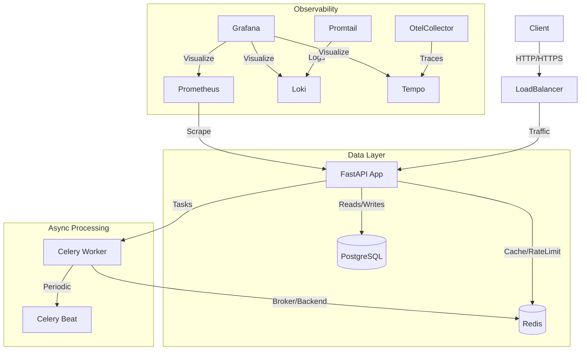

# Architecture & Design

## System Overview

The application follows a layered architecture to ensure separation of concerns and maintainability.

## Core Components

### 1. Application Layer (FastAPI)
- **Framework**: FastAPI (Async, Type-safe).
- **Patterns**: repository-service pattern.
  - **Repositories**: Handle direct DB interactions (SQLAlchemy). Contains caching logic.
  - **Services**: Handle business logic.
  - **Routers**: Handle HTTP request/response and schema validation.

### 2. Infrastructure
- **Database**: PostgreSQL 15 with async SQLAlchemy connector (`asyncpg`).
  - Uses `alembic` for migrations.
  - Configured with connection pooling for performance.
- **Cache**: Redis 7.
  - Used for Caching (User profiles), Rate Limiting, and Celery Broker.

### 3. Security
- **Authentication**: OAuth2 with Password Flow (JWT).
- **Middleware**:
  - `SecurityHeadersMiddleware`: HSTS, XSS, Frame Options.
  - `RateLimitMiddleware`: IP-based limiting.
  - `CORSMiddleware`: Restrictive origin policies.
- **Container Hardening**:
  - Non-root user execution.
  - Read-only root filesystem (where applicable).
  - Dropped Linux capabilities.

## Design Decisions

- **Async First**: All I/O bound operations (DB, Redis, HTTP) are async to maximize throughput.
- **Dependency Injection**: Heavy use of `Depends()` for DB sessions, Current User, and Services to ensure testability.
- **Observability First**: Built with metrics, logs, and traces from day one to ensure production visibility.
